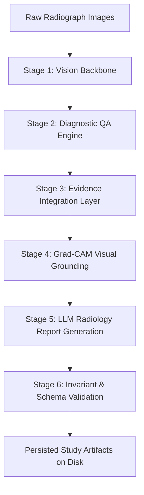

# Multi-Study Batch Processing & Real Inference Architecture

## 1. Overview & Purpose
The Explainable Radiology Research Prototype indexes over 1,114+ IU X-Ray studies. To support scalable evaluation, external validation, and seamless clinician exploration, arbitrary studies can be processed through the genuine 6-stage machine inference pipeline.

> [!IMPORTANT]
> **Zero Ground-Truth Leakage Invariant:** The machine pipeline strictly processes raw image radiographs using TorchXRayVision DenseNet-121. Ground truth XML reports (`ecgen-radiology/*.xml`) are never read, accessed, or injected during any inference stage.

---

## 2. Six-Stage Inference Pipeline Lifecycle
For each target study (`study_id`), the pipeline runs synchronously or asynchronously across 6 discrete stages:



### Stage Breakdown
1. **Stage 1: Vision Backbone (`VISION_RUNNING`)**
   - Preprocesses study radiographs (`transforms.Compose([Resize(224), ToTensor(), ...])`).
   - Runs inference through DenseNet-121 (`torchxrayvision.models.DenseNet(weights="densenet121-res224-all")`).
   - Extracts 18 pathology logits and calibrated probabilities.
   - Saves: `vision_output.json`.

2. **Stage 2: Diagnostic QA Engine (`QA_RUNNING`)**
   - Formulates clinical questions per candidate finding based on pathology mapping.
   - Computes answering confidence scores and anatomical localization.
   - Saves: `qa_output.json`.

3. **Stage 3: Evidence Integration Layer (`EVIDENCE_RUNNING`)**
   - Synthesizes visual confidence, QA answers, and clinical significance thresholds.
   - Produces candidate findings hierarchy (`evidence_package.json`).

4. **Stage 4: Grad-CAM Visual Grounding (`GROUNDING_RUNNING`)**
   - Computes gradient-weighted class activation maps from the final convolutional layer of DenseNet-121 (`features.denseblock4`).
   - Generates heatmap PNGs and composite overlay PNGs for each identified finding.
   - Saves: `grounding_package.json`, plus heatmaps in `data/iu_xray/grounding/{study_id}_{image_id}_{finding}_overlay.png`.

5. **Stage 5: LLM Radiology Report Generation (`LLM_RUNNING`)**
   - Synthesizes findings and impressions with grounded citations.
   - Preserves clinical tone and non-diagnostic research disclaimers.
   - Saves: `generated_report.json`.

6. **Stage 6: Invariant Validation (`VALIDATING`)**
   - Validates all generated packages against strict JSON schemas (`evidence_schema.json`, `grounding_schema.json`, `report_schema.json`).
   - Saves: `validation_result.json` and `study_meta.json`.

---

## 3. Directory Layout & Artifact Persistence
Every processed study persists all machine artifacts deterministically under its unique directory:

```
data/iu_xray/studies/{study_id}/
├── vision_output.json        # DenseNet-121 pathology probabilities & logits
├── qa_output.json            # Structured diagnostic questions & answers
├── evidence_package.json     # Synthesized candidate findings & thresholds
├── grounding_package.json    # Grad-CAM attribution references & bounding boxes
├── generated_report.json     # Findings, Impressions, and Evidence links
├── validation_result.json    # Validation audit log (status: PASS/FAIL)
└── study_meta.json           # Machine pipeline execution metadata & timestamp
```

Visual attribution overlays are saved to:
```
data/iu_xray/grounding/{study_id}_{image_id}_{finding}_overlay.png
```

---

## 4. API Endpoints

### 4.1 Process Single Study
- **Endpoint:** `POST /api/studies/{study_id}/process`
- **Payload:** `{"force": false}`
- **Response:**
  ```json
  {
    "status": "success",
    "study_id": "CXR1007",
    "pipeline_status": "COMPLETED",
    "findings_count": 7,
    "images_count": 2,
    "generated_at": "2026-09-24T06:36:20Z"
  }
  ```

### 4.2 Start Batch Inference Job
- **Endpoint:** `POST /api/batch/process` or `POST /api/batch/run`
- **Payload:**
  ```json
  {
    "study_ids": ["CXR1007", "CXR1009", "CXR1401"],
    "force": false
  }
  ```
- **Response:**
  ```json
  {
    "status": "success",
    "job_id": "batch_8a2d1ef9",
    "total_studies": 3,
    "state": "RUNNING"
  }
  ```

### 4.3 Query Batch Job Status
- **Endpoint:** `GET /api/batch/{job_id}`
- **Response:**
  ```json
  {
    "job_id": "batch_8a2d1ef9",
    "status": "RUNNING",
    "total": 3,
    "completed": 1,
    "failed": 0,
    "percent": 33.3,
    "active_study_id": "CXR1009",
    "active_stage": "GROUNDING_RUNNING",
    "study_progress": {
      "CXR1007": {"status": "COMPLETED", "error": null, "duration": 3.2},
      "CXR1009": {"status": "RUNNING", "current_stage": "GROUNDING_RUNNING"},
      "CXR1401": {"status": "PENDING", "current_stage": "PENDING"}
    }
  }
  ```

---

## 5. UI Integration & Race Condition Protection
1. **Candidate Findings Panel Status State**:
   - If a study has not yet undergone machine inference, the UI displays the `[INFERENCE NOT RUN]` banner with an interactive `[Run Inference for This Study]` action button.
   - When inference completes, the UI re-fetches machine artifacts dynamically and displays the candidate findings list.
2. **Race Condition Prevention**:
   - `frontend/app.js` employs a sequential request monotonic counter `_studyRequestSeq`.
   - Any late-arriving asynchronous fetch response from a previous study is automatically discarded if a newer study has been selected.
   - The UI immediately clears the DICOM/PNG canvas, clears evidence tables, and displays a clean spinner while switching.
3. **Batch Runner Modal**:
   - Live polling with 1.0s interval.
   - Displays real-time progress bar, completed count, active stage pill (`VISION`, `QA`, `EVIDENCE`, `GROUNDING`, `LLM`, `VALIDATING`), and individual per-study status indicators.

---

## 6. Safety & Immutability Invariants
1. **Model Reuse Singleton**: The TorchXRayVision DenseNet-121 backbone is lazily loaded and cached across batch studies to maximize inference throughput.
2. **Failure Isolation**: An unreadable DICOM or corrupt image in one study triggers `FAILED` status for that specific study without interrupting or aborting the remainder of the batch cohort.
3. **Reviewer / Consensus Layer Immutability**: Batch machine inference writes exclusively to `data/iu_xray/studies/{study_id}/` and never mutates human reviews (`data/reviews/`) or consensus packages (`data/consensus/`).
