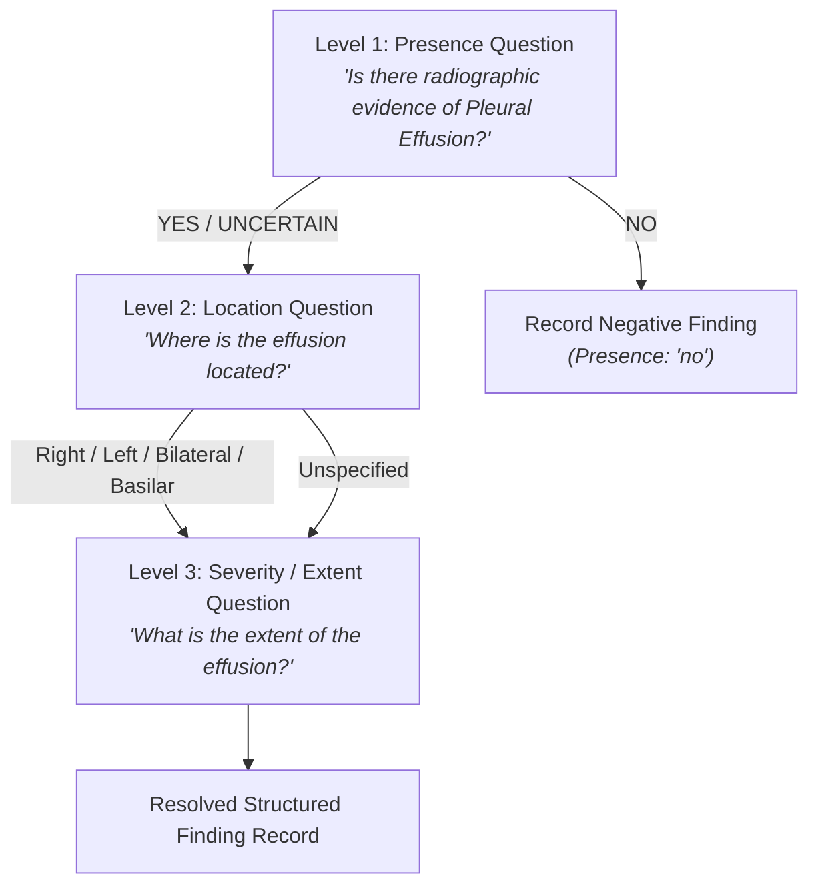

# Phase 0.5 — Diagnostic Questioning Design Specification (Revised)

**Project**: LLM-Assisted Explainable Radiology Report Generation Using Diagnostic Questioning  
**Document Version**: 1.1 (Revised)  
**Phase**: 0.5 (Design & Data Analysis)  
**Status**: DESIGN COMPLETE & REVISED  

---

## 1. Objective & Three-Way Information Architecture

The goal of the Diagnostic Questioning module is to act as an interpretable, clinically structured bridge between continuous visual representations (DenseNet-121 features and pathology activations) and natural language generation (LLM report generation).

```text
========================================================================================
                          THREE-WAY INFORMATION ARCHITECTURE
========================================================================================

[A. VISION OUTPUT]
Chest X-ray Image
      ↓
TorchXRayVision DenseNet-121
      ├── 1024-D Visual Feature Vector
      └── 18 Pathology Activations (model_score ∈ [0.0, 1.0])
      ↓
[B. DIAGNOSTIC QA ENGINE]
Configurable Question Selection (Baseline Findings + Top-K + Threshold τ)
      ↓
Deterministic Diagnostic Questions (Level 1: Presence → Level 2: Location → Level 3: Severity)
      ↓
Structured QA Output (presence, non-hallucinated location/severity, model_score)
      ↓
[C. GROUND TRUTH COMPARISON]
IU X-Ray Report XML
      ↓
Ground-Truth Finding Extraction (FINDINGS & IMPRESSION)
      ↓
Comparative Evaluation (Agreement / Matched / Missed / Extra)
========================================================================================
```

> [!IMPORTANT]
> **Strict Separation of Data Sources**:
> 1. **Vision Output**: Contains raw candidate pathologies and `model_score` activations. Model scores indicate pattern correlations, NOT clinical probabilities or ground-truth disease presence.
> 2. **QA Output**: Formulates structured questions and captures answers (`presence`, `location`, `severity`, `model_score`). Location and severity are NOT fabricated or derived directly from scalar pathology scores; they remain `"unspecified"` unless explicitly supported by evidence.
> 3. **Ground Truth**: Derived independently from the official radiologist report text in the IU X-Ray dataset.

---

## 2. Upstream Vision Pipeline

In Phases 0.3 and 0.4, the vision backbone was validated on the official Indiana University Chest X-Ray (Open-i / NLM) dataset:
1. **Pretrained Model**: TorchXRayVision `DenseNet-121` (`densenet121-res224-all`).
2. **Preprocessing**: 2D Grayscale $\rightarrow$ Dynamic range $[-1024, 1024]$ $\rightarrow$ Center crop $\rightarrow$ Resize to $224 \times 224$ $\rightarrow$ Input shape `[1, 1, 224, 224]`.
3. **Outputs Produced**:
   - **Internal Representation**: `[1, 1024]` visual feature vector extracted via `model.features2(x)`.
   - **Pathology Activations**: 18 calibrated prediction scores (`model_score`) corresponding to thoracic conditions.

---

## 3. Dataset Analysis Methodology

Empirical text-mining was performed across all **3,955 XML clinical reports** in `data/iu_xray/reports/ecgen-radiology/` to ground the questioning schema in real radiologist practice.

### Corpus Overview:
- **Total Reports Analyzed**: 3,955
- **Reports with `FINDINGS`**: 3,425 (86.6%)
- **Reports with `IMPRESSION`**: 3,921 (99.1%)
- **Reports with both `FINDINGS` and `IMPRESSION`**: 3,419 (86.4%)
- **Average Word Count**:
  - `FINDINGS`: 31.6 words (concise, structured descriptions of lungs, pleura, heart, bones)
  - `IMPRESSION`: 10.7 words (bulleted summary or single-line diagnostic synthesis)

---

## 4. Common Report Findings in IU X-Ray

Empirical text-mining over the 3,955 reports revealed the true distribution of findings and established that **pertinent negatives are as prevalent as positive findings**.

### Table 1: Occurrence of 18 TorchXRayVision Pathologies in IU X-Ray Corpus

| Pathology Class | Positive Mentions (Count) | Negated Mentions (Count) | Clinical Context / Reporting Pattern |
| :--- | :---: | :---: | :--- |
| **Lung Opacity** | **835** | 273 | Generic descriptor for infiltrates, atelectasis, consolidation |
| **Effusion** | **688** | **1,916** | Crucial routine check ("no pleural effusion" in 48.4% of reports) |
| **Nodule** | **562** | 143 | Predominantly benign calcified granulomas (histoplasmosis) |
| **Atelectasis** | **539** | 15 | Common bibasilar/subsegmental collapse; rarely negated |
| **Pneumothorax** | **461** | **2,276** | Routine acute exclusion ("no pneumothorax" in 57.5% of reports) |
| **Cardiomegaly** | **366** | 65 | Cardiac enlargement; frequently reported as normal silhouette |
| **Consolidation** | **330** | **1,481** | Airspace opacification; heavily negated in normal exams |
| **Emphysema** | **204** | 18 | Described as hyperinflation or flattened diaphragms |
| **Edema** | **162** | 285 | Pulmonary vascular congestion or interstitial edema |
| **Fracture** | **156** | 128 | Rib fractures or thoracic spine compression fractures |
| **Infiltration** | **131** | 334 | Overlaps with airspace disease; frequently negated |
| **Pneumonia** | **116** | 177 | Clinical diagnosis; visual correlate is focal consolidation |
| **Fibrosis** | **110** | 7 | Interstitial markings, reticular opacities, apical scarring |
| **Mass** | **108** | 112 | Lesions $>3\text{ cm}$; usually prompts recommendation for chest CT |
| **Hernia** | **71** | 10 | Almost exclusively hiatal hernia (retrocardiac mass with air) |
| **Pleural_Thickening**| **46** | 2 | Apical pleural capping or calcified pleural plaques |
| **Lung Lesion** | **16** | 3 | Generic term; radiologists prefer "nodule" or "mass" |
| **Enlarged Cardiomediastinum** | **2** | 35 | Rarely phrased verbatim; described as tortuous aorta/cardiomegaly |

### Additional Frequent Non-Model Concepts in Reports:
1. **Normal / Clear Lungs**: Present in **2,625 reports (66.4%)** (*"The lungs are clear. No acute cardiopulmonary abnormality."*).
2. **Degenerative Spine / Scoliosis / Bone Disease**: Present in **645 reports (16.3%)** (*"Degenerative changes of the thoracic spine."*).
3. **Calcified Granuloma / Calcification**: Present in **590 reports (14.9%)** (*"Stable calcified granuloma right upper lobe."*).
4. **Support Devices / Post-Surgical**: Present in **330 reports (8.3%)** (*"Median sternotomy wires", "pacemaker leads"*).
5. **Aortic Tortuosity / Atherosclerosis**: Present in **92 reports (2.3%)** (*"Tortuous ectatic thoracic aorta."*).

---

## 5. Vision-Model-to-Report Concept Mapping

Based on the empirical frequency analysis, the 18 DenseNet-121 pathology outputs map into three distinct categories:

### A. Direct Clinical Matches (12 classes)
- `Atelectasis` $\leftrightarrow$ *atelectasis, subsegmental atelectasis, linear collapse, bandlike opacity*
- `Consolidation` $\leftrightarrow$ *consolidation, focal airspace disease, dense consolidation*
- `Pneumothorax` $\leftrightarrow$ *pneumothorax, apical pneumothorax*
- `Edema` $\leftrightarrow$ *pulmonary edema, vascular congestion, perihilar haziness*
- `Emphysema` $\leftrightarrow$ *emphysema, hyperinflation, hyperexpansion*
- `Effusion` $\leftrightarrow$ *pleural effusion, blunting of costophrenic sulcus*
- `Cardiomegaly` $\leftrightarrow$ *cardiomegaly, enlarged heart, prominent cardiac silhouette*
- `Nodule` $\leftrightarrow$ *pulmonary nodule, calcified granuloma, nodular density*
- `Mass` $\leftrightarrow$ *lung mass, hilar mass, mediastinal neoplasm*
- `Hernia` $\leftrightarrow$ *hiatal hernia, retrocardiac soft tissue density*
- `Fracture` $\leftrightarrow$ *rib fracture, clavicle fracture, vertebral compression deformity*
- `Lung Opacity` $\leftrightarrow$ *lung opacity, airspace opacity, patchy density*

### B. Approximate / Semantic Overlap Matches (5 classes)
- `Infiltration`: Radiologists in IU X-Ray frequently use *"airspace opacity"* or *"focal consolidation"* rather than *"infiltrate"*.
- `Pneumonia`: Pneumonia is a clinical diagnosis. Radiologists describe the imaging finding as *"consolidation"* or *"airspace disease"* and list pneumonia in the `IMPRESSION` differential.
- `Fibrosis`: Described in reports as *"prominent interstitial markings"*, *"reticular opacities"*, or *"apical scarring"*.
- `Pleural_Thickening`: Frequently phrased as *"apical capping"* or *"pleural plaques"*.
- `Enlarged Cardiomediastinum`: Usually split into *"cardiomegaly"* vs *"tortuous / ectatic aorta"*.

### C. Rarely Represented Concept (1 class)
- `Lung Lesion`: Rarely appears as a literal phrase (16 mentions in 3,955 reports). Handled as a generic synonym for `Nodule` / `Mass`.

---

## 6. Supported vs Unsupported QA Fields

Empirical evaluation of the reports indicates what information can realistically be structured:

| QA Field | Support Classification | Empirical Evidence in IU X-Ray | Design & Prototype Treatment |
| :--- | :---: | :--- | :--- |
| **Finding** | **SUPPORTED** | 18 model classes map to 95%+ of clinical chest conditions. | Standardized enum name. |
| **Presence** | **SUPPORTED** | 99%+ of reports explicitly document presence or absence ("no pneumothorax"). | `"yes"`, `"no"`, `"uncertain"`. |
| **Location** | **PARTIALLY SUPPORTED** | Present in ~45% of reports (lateralization: right/left/bilateral; lobes: upper/lower/base). Absent for systemic/diffuse findings. | **Never hallucinated from scalar scores.** Defaults to `"unspecified"`. |
| **Severity** | **PARTIALLY SUPPORTED** | Present in ~35% of reports ("small", "minimal", "moderate", "large", "mild", "severe"). Unstated in 65%. | **Never hallucinated from scalar scores.** Defaults to `"unspecified"`. |
| **model_score** | **SUPPORTED** | Continuous raw output activation from DenseNet-121 inference $\in [0.0, 1.0]$. | Float score (explicitly labeled `model_score`). |
| **Evidence Source** | **SUPPORTED** | Tracks whether finding originated from vision model, report reference, or future grounding. | `"vision_model"`, `"report_ground_truth"`, `"qa_engine"`. |

---

## 7. Question Taxonomy Design

The question taxonomy is organized into a **conditional 3-level hierarchy**:



### Level 1 — Presence Questions
Targeting presence, absence, or ambiguity:
- `Q_EFFUSION_PRESENCE`: *"Is there evidence of pleural effusion or costophrenic angle blunting?"* $\rightarrow$ `["yes", "no", "uncertain"]`
- `Q_PNEUMOTHORAX_PRESENCE`: *"Is there radiographic evidence of a pneumothorax?"* $\rightarrow$ `["yes", "no", "uncertain"]`
- `Q_CARDIOMEGALY_PRESENCE`: *"Is cardiomegaly or cardiac enlargement present?"* $\rightarrow$ `["yes", "no", "uncertain"]`
- `Q_OPACITY_PRESENCE`: *"Are there focal or diffuse lung opacities / consolidations?"* $\rightarrow$ `["yes", "no", "uncertain"]`
- `Q_NODULE_PRESENCE`: *"Is there evidence of pulmonary nodules or granulomas?"* $\rightarrow$ `["yes", "no", "uncertain"]`

### Level 2 — Location Questions (Conditional on Level 1 = "yes" / "uncertain")
Targeting anatomical lateralization and distribution:
- `Q_LOCATION`: *"Where is the {finding} located?"*
  - Allowed options: `["right", "left", "bilateral", "right_upper_lobe", "right_middle_lobe", "right_lower_lobe", "left_upper_lobe", "left_lower_lobe", "basilar", "apical", "retrocardiac", "mediastinum", "diffuse", "unspecified"]`

### Level 3 — Severity / Extent Questions (Conditional on Level 1 = "yes" & Relevant Pathology)
Targeting degree of abnormality when clinically meaningful:
- `Q_SEVERITY`: *"What is the severity or extent of the {finding}?"*
  - Allowed options: `["small", "minimal", "moderate", "large", "mild", "severe", "trace", "unspecified"]`

---

## 8. Hybrid Question Selection Logic & Configurable Parameters

The vision model's 18 pathology activation scores determine which diagnostic questions are triggered during evaluation:

```text
DenseNet-121 Inference (18 pathology scores)
    ↓
1. Baseline Routine Inclusions (Configurable list:
   Pneumothorax, Effusion, Consolidation / Lung Opacity, Cardiomegaly)
    +
2. Top-K Selection (Configurable TOP_K, default = 3, highest activation outside baseline)
    +
3. Threshold Trigger (Any finding with model_score >= QA_THRESHOLD, default = 0.35)
    ↓
Final Question Queue (Deduplicated list of candidate findings)
```

> [!NOTE]
> **Prototype Parameter Clarification**:
> The parameters `TOP_K = 3`, `QA_THRESHOLD = 0.35`, and the baseline set are **prototype engineering parameters** designed to balance coverage and conciseness. They are **not medically validated clinical thresholds**.

---

## 9. Structured QA JSON Schema

Formalized in `docs/qa_schema.json`:

```json
{
  "study_id": "CXR1122",
  "image_id": "CXR1122_IM-0080-1001-0002",
  "view": "Frontal",
  "vision_candidates": [
    {
      "finding": "Pneumothorax",
      "model_score": 0.219,
      "is_baseline": true,
      "selection_reason": "baseline"
    }
  ],
  "questions_evaluated": [
    {
      "question_id": "Q_PNEUMOTHORAX_PRESENCE",
      "finding": "Pneumothorax",
      "level": 1,
      "question_text": "Is there radiographic evidence of a pneumothorax?",
      "answer": "no",
      "options": ["yes", "no", "uncertain"],
      "model_score": 0.219
    }
  ],
  "qa_findings": [
    {
      "finding": "Pneumothorax",
      "presence": "no",
      "location": "unspecified",
      "severity": "unspecified",
      "model_score": 0.219,
      "evidence_source": "qa_engine"
    }
  ]
}
```

---

## 10. Question $\rightarrow$ Answer $\rightarrow$ Finding Transformation Flow

```text
[Step 1: Model Signal]
DenseNet-121 evaluates "Effusion" -> model_score = 0.685

[Step 2: Level 1 Question]
Q_EFFUSION_PRESENCE: "Is there evidence of pleural effusion?"
Answer: "yes" (model_score: 0.685)

[Step 3: Level 2 Follow-Up (if supported by evidence)]
Q_EFFUSION_LOCATION: "Where is the effusion located?"
Answer: "right" (or "unspecified" if unobserved)

[Step 4: Level 3 Follow-Up (if supported by evidence)]
Q_EFFUSION_SEVERITY: "What is the severity or extent of the effusion?"
Answer: "small" (or "unspecified" if unobserved)

[Step 5: Synthesized Finding Object]
{
  "finding": "Effusion",
  "presence": "yes",
  "location": "right",
  "severity": "small",
  "model_score": 0.685,
  "evidence_source": "qa_engine"
}
```

---

## 11. Ground-Truth Case Study Conversions

### Case Study 1: Normal Study (`CXR1`)
- **Original Report**:
  - `FINDINGS`: *"The cardiac silhouette and mediastinum size are within normal limits. There is no pulmonary edema. There is no focal consolidation. There are no XXXX of a pleural effusion. There is no evidence of pneumothorax."*
  - `IMPRESSION`: *"Normal chest x-XXXX."*
- **Ground-Truth QA Representation**:
  ```json
  [
    {"finding": "Pneumothorax", "presence": "no", "location": "unspecified", "severity": "unspecified", "model_score": null, "evidence_source": "report_ground_truth"},
    {"finding": "Effusion", "presence": "no", "location": "unspecified", "severity": "unspecified", "model_score": null, "evidence_source": "report_ground_truth"},
    {"finding": "Consolidation", "presence": "no", "location": "unspecified", "severity": "unspecified", "model_score": null, "evidence_source": "report_ground_truth"},
    {"finding": "Edema", "presence": "no", "location": "unspecified", "severity": "unspecified", "model_score": null, "evidence_source": "report_ground_truth"},
    {"finding": "Cardiomegaly", "presence": "no", "location": "unspecified", "severity": "unspecified", "model_score": null, "evidence_source": "report_ground_truth"}
  ]
  ```

### Case Study 2: Single Abnormal Finding (`CXR1001`)
- **Original Report**:
  - `FINDINGS`: *"Interstitial markings are diffusely prominent throughout both lungs. Heart size is normal. Pulmonary XXXX normal."*
  - `IMPRESSION`: *"Diffuse fibrosis. No visible focal acute disease."*
- **Ground-Truth QA Representation**:
  ```json
  [
    {"finding": "Fibrosis", "presence": "yes", "location": "bilateral", "severity": "unspecified", "model_score": null, "evidence_source": "report_ground_truth"},
    {"finding": "Cardiomegaly", "presence": "no", "location": "unspecified", "severity": "unspecified", "model_score": null, "evidence_source": "report_ground_truth"},
    {"finding": "Pneumothorax", "presence": "no", "location": "unspecified", "severity": "unspecified", "model_score": null, "evidence_source": "report_ground_truth"}
  ]
  ```

### Case Study 3: Multiple Findings (`CXR1000`)
- **Original Report**:
  - `FINDINGS`: *"There is increased opacity within the right upper lobe with possible mass and associated area of atelectasis or focal consolidation. XXXX opacity in the left midlung overlying the posterior left 5th rib may represent focal airspace disease. No pleural effusion or pneumothorax."*
  - `IMPRESSION`: *"1. Increased opacity in the right upper lobe with associated atelectasis may represent focal consolidation or mass lesion. 2. Opacity overlying the left 5th rib may represent focal airspace disease."*
- **Ground-Truth QA Representation**:
  ```json
  [
    {"finding": "Lung Opacity", "presence": "yes", "location": "right_upper_lobe", "severity": "unspecified", "model_score": null, "evidence_source": "report_ground_truth"},
    {"finding": "Atelectasis", "presence": "yes", "location": "right_upper_lobe", "severity": "unspecified", "model_score": null, "evidence_source": "report_ground_truth"},
    {"finding": "Consolidation", "presence": "uncertain", "location": "right_upper_lobe", "severity": "unspecified", "model_score": null, "evidence_source": "report_ground_truth"},
    {"finding": "Mass", "presence": "uncertain", "location": "right_upper_lobe", "severity": "unspecified", "model_score": null, "evidence_source": "report_ground_truth"},
    {"finding": "Effusion", "presence": "no", "location": "unspecified", "severity": "unspecified", "model_score": null, "evidence_source": "report_ground_truth"},
    {"finding": "Pneumothorax", "presence": "no", "location": "unspecified", "severity": "unspecified", "model_score": null, "evidence_source": "report_ground_truth"}
  ]
  ```

---

## 12. Documented Limitations

1. **Inconsistent Severity Reporting**: 65% of IU X-Ray reports do not mention severity or extent. Location and severity must never be inferred or hallucinated from scalar vision scores.
2. **Model Scores vs Clinical Diagnosis**: DenseNet-121 activation scores (`model_score`) indicate pattern correlations, not definitive clinical diagnoses. They serve only as question triggers.
3. **Out-of-Vocabulary Clinical Entities**: Degenerative bone changes (16.3% of reports), benign calcified granulomas (14.9%), and sternotomy wires/devices (8.3%) are frequent in reports but are not part of the 18 DenseNet classes.
4. **View Dependency**: Lateral views provide distinct anatomical depth (e.g., retrocardiac space) not fully resolved on frontal views alone.
5. **Class Imbalance in Corpus**: Findings such as *Hernia* (71 cases), *Pleural Thickening* (46 cases), and *Lung Lesion* (16 cases) are sparse compared to *Effusion* (688 cases) and *Atelectasis* (539 cases).
