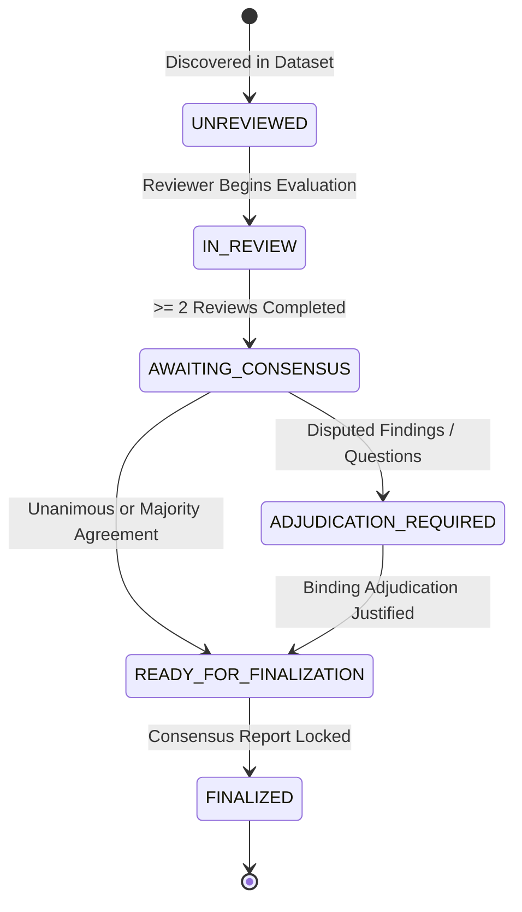

# Phase 1.4 — Multi-Study Dataset Management, Review Queue & Evaluation Analytics

> **RESEARCH PROTOTYPE DISCLAIMER**  
> This system is an academic research prototype. Machine activation scores are mathematical model outputs and are **not clinical probabilities or diagnostic certainty**. Grad-CAM visual heatmaps represent neural-network feature attribution and are **not validated lesion localization, segmentation masks, or definitive anatomical localization**. Human reviewer annotations, consensus syntheses, and adjudicated reports are research metadata and must **not be interpreted as certified clinical ground truth or clinical diagnoses**.

---

## 1. Architectural Overview

Phase 1.4 extends the Explainable Radiology Research Prototype from a single-study demonstration into a full **Multi-Study Research Review Platform**.

```
+---------------------------------------------------------------------------------------------------+
|                                      DATASET MANAGEMENT & QUEUE                                    |
|  * Dynamic Study Discovery   * Study Lifecycle Tracking   * Deterministic Review Queue Filtering   |
+---------------------------------------------------------------------------------------------------+
                                                  │
                                                  ▼
+---------------------------------------------------------------------------------------------------+
|                                5-TIER SEPARATION OF CONCERNS                                      |
|                                                                                                   |
|  1. MACHINE EVIDENCE LAYER (READ-ONLY)                                                            |
|     data/iu_xray/  ==>  Model Activations, Diagnostic QA, Evidence Layer, Grad-CAM, Reports       |
|                                                                                                   |
|  2. INDIVIDUAL HUMAN REVIEW LAYER                                                                 |
|     data/reviews/{study_id}_{reviewer_id}.json  ==>  Clinician Annotations & Modifications        |
|                                                                                                   |
|  3. MULTI-REVIEWER CONSENSUS LAYER                                                                |
|     data/consensus/{study_id}.json  ==>  Statistical Agreement, Rater Concordance, Metrics       |
|                                                                                                   |
|  4. DISPUTE ADJUDICATION LAYER                                                                    |
|     Binding Rationale, Clinical Justification Records, Conflict Resolution                        |
|                                                                                                   |
|  5. RATIFIED CONSENSUS REPORT LAYER                                                               |
|     Permanent Finalization Lock, Research Metadata Exports (JSON / Text)                          |
+---------------------------------------------------------------------------------------------------+
                                                  │
                                                  ▼
+---------------------------------------------------------------------------------------------------+
|                                EVALUATION & WORKFLOW ANALYTICS                                    |
|  * Review Metrics (Completion Rate, Reviewer Counts)                                              |
|  * Inter-Rater Agreement (Cohen's Kappa for N=2, Fleiss' Kappa for N>=3)                          |
|  * Reviewer Workflow Activity Monitoring (Non-Evaluative)                                         |
|  * End-to-End Study Provenance & Audit Trail (8 Stages)                                           |
+---------------------------------------------------------------------------------------------------+
```

---

## 2. Study Lifecycle State Machine

The platform implements a deterministic 6-state lifecycle model:



### Lifecycle State Definitions:

| State | Criteria | Client Permissions |
|---|---|---|
| `UNREVIEWED` | No reviewer sessions started (0 active evaluations). | Start Review |
| `IN_REVIEW` | At least 1 review in progress or completed, but $< 2$ completed reviews. | Continue Review |
| `AWAITING_CONSENSUS` | $\ge 2$ independent reviewers have completed their reviews. | Trigger Consensus Synthesis |
| `ADJUDICATION_REQUIRED` | Finding or QA disagreement requires binding clinician resolution. | Adjudicate Dispute |
| `READY_FOR_FINALIZATION` | All disputes resolved or majority agreement reached; draft report ready. | Edit Draft / Finalize |
| `FINALIZED` | Consensus report ratified; permanent write-lock engaged. | Read-Only / Export |

---

## 3. Review Queue Management

The review queue module ([`backend/review_queue.py`](file:///c:/Users/ankit/OneDrive/Desktop/radio-llm/backend/review_queue.py)) generates deterministic queues without subjective clinical prioritization:

### Supported Query Filters:
- `status`: Filter by workflow state (`UNREVIEWED`, `IN_REVIEW`, `AWAITING_CONSENSUS`, `ADJUDICATION_REQUIRED`, `READY_FOR_FINALIZATION`, `FINALIZED`).
- `consensus_status`: Filter by consensus state (`NOT_STARTED`, `PENDING`, `CONSENSUS_READY`, `ADJUDICATION_REQUIRED`, `FINALIZED`).
- `adjudication_required`: Boolean flag (`true` / `false`).
- `finalized`: Boolean flag (`true` / `false`).
- `reviewer_count`: Integer filter for number of participating reviewers.
- `q` / `query`: Search against study ID metadata.

### Deterministic Sorting:
- Natural study ID alphanumeric ordering (e.g., `CXR1005`, `CXR1007`, `CXR1122`).
- `last_updated`: Newest / oldest modification timestamp.
- `reviewer_count`: Highest / lowest participation.
- `workflow_status`: Lifecycle progression order.

---

## 4. Statistical Inter-Rater Agreement & Evaluation Analytics

The evaluation manager ([`backend/evaluation_manager.py`](file:///c:/Users/ankit/OneDrive/Desktop/radio-llm/backend/evaluation_manager.py)) provides rigorous statistical agreement synthesis:

### Mathematical Formulations:

1. **Observed Agreement Ratio ($P_o$)**:
   $$P_o = \frac{1}{K} \sum_{k=1}^K \frac{\max(n_{k1}, n_{k2}, \dots, n_{kC})}{N}$$
   where $K$ is the number of candidate findings, $N$ is the number of reviewers, and $n_{kc}$ is the count of raters assigning category $c$ to finding $k$.

2. **Cohen's Kappa ($\kappa$)** — *Strictly for $N=2$ reviewers*:
   $$\kappa = \frac{P_o - P_e}{1 - P_e}$$
   where $P_e = \sum_{c} p_{1c} \cdot p_{2c}$ is the expected chance agreement.

3. **Fleiss' Kappa ($\kappa$)** — *Strictly for $N \ge 3$ reviewers*:
   $$\kappa = \frac{\bar{P} - \bar{P}_e}{1 - \bar{P}_e}$$
   across 4 discrete evaluation categories (`supported`, `uncertain`, `refuted`, `not_reviewed`).

> [!NOTE]
> Agreement statistics are strictly bounded in $[-1.0, 1.0]$. The system never averages incompatible statistics (e.g. Cohen's and Fleiss' Kappas) and always reports sample size ($N$).

---

## 5. Non-Evaluative Reviewer Workflow Activity Monitoring

The platform includes operational tracking for research coordinators without evaluative rankings:

| Reviewer ID | Studies Assigned | Studies Completed | Findings Evaluated | Consensus Participation | Adjudications Conducted |
|---|---|---|---|---|---|
| `researcher_01` | 1 | 1 | 7 | 1 | 0 |
| `rev_02` | 1 | 1 | 7 | 1 | 0 |
| `rev_03` | 1 | 1 | 7 | 1 | 0 |
| `lead_adjudicator` | 0 | 0 | 0 | 1 | 1 |

*Zero clinician performance scores, accuracy rankings, or competitive metrics.*

---

## 6. End-to-End Study Provenance Pipeline

Every study exposes a complete, sanitized 8-stage audit trail via `GET /api/studies/{study_id}/provenance`:

```
Stage 1: Vision Backbone (DenseNet-121) ─────────────► Extracted 18 activations & 1024-D features
    │
Stage 2: Diagnostic QA Engine ───────────────────────► Evaluated candidate finding questions
    │
Stage 3: Evidence Layer (Immutable) ─────────────────► Resolved supported/possible/uncertain states
    │
Stage 4: Grad-CAM Visual Grounding ──────────────────► Computed norm5 feature attribution maps
    │
Stage 5: LLM Report Generation ──────────────────────► Synthesized FINDINGS + IMPRESSION sections
    │
Stage 6: Individual Human Review ────────────────────► Captured independent reviewer annotations
    │
Stage 7: Multi-Reviewer Consensus Synthesis ─────────► Calculated rater concordances & agreement
    │
Stage 8: Finalized Research Report ──────────────────► Engaged write-lock & generated export package
```

---

## 7. REST API Reference

| Method | Endpoint | Description |
|---|---|---|
| `GET` | `/api/studies` | Sanitized multi-study summary listing. |
| `GET` | `/api/studies/search?q={query}` | Search study ID metadata. |
| `GET` | `/api/studies/{study_id}/summary` | Formal `StudySummary` JSON schema object. |
| `GET` | `/api/studies/{study_id}/status` | Current lifecycle and workflow status. |
| `GET` | `/api/studies/{study_id}/provenance` | Complete 8-stage provenance audit trail. |
| `GET` | `/api/studies/{study_id}/export?format={json\|text}` | Single-study export package. |
| `GET` | `/api/review-queue` | Filtered and sorted review queue. |
| `GET` | `/api/dataset/stats` | Lifecycle overview counts across all studies. |
| `GET` | `/api/dataset/analytics` | Statistical agreement, consensus metrics, and reviewer activity. |
| `GET` | `/api/dataset/export?format={json\|text}` | Full multi-study dataset export. |

---

## 8. Verification & Test Suite

Run full automated tests and verification pipelines:

```powershell
# Run Full Test Suite (168 + 33 = 201 Tests)
backend\venv\Scripts\python -m unittest discover -s tests -v

# Run Phase 1.4 End-to-End Simulation Pipeline (16 Stages)
backend\venv\Scripts\python backend/run_e2e_phase_1_4.py
```
