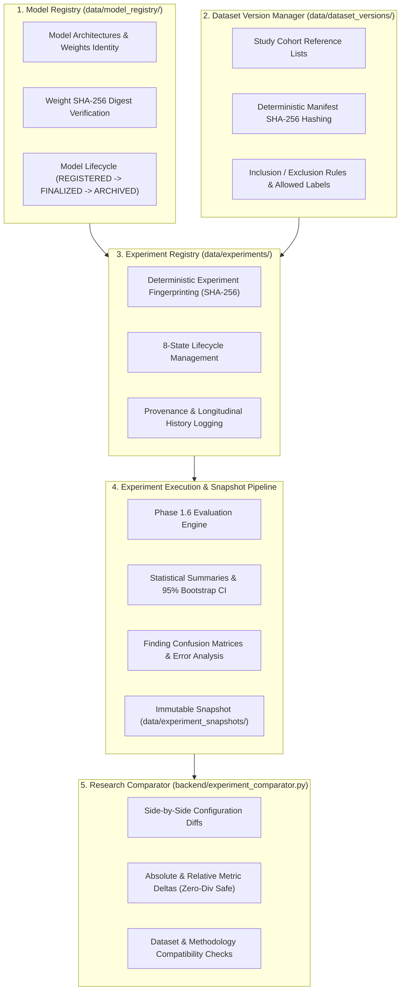

# Phase 1.7 — Reproducible Experiment Registry, Model Versioning & Longitudinal Research Tracking

> **RESEARCH PROTOTYPE NOTICE**  
> **RESEARCH EXPERIMENT RECORD — NOT CLINICAL PERFORMANCE EVIDENCE**  
> This software is an investigative research platform designed for reproducible experimentation, explainable evidence tracking, and longitudinal model benchmarking. It does not provide medical diagnostic recommendations, does not make clinical efficacy claims, and does not designate any machine learning model or experiment configuration as "superior", "best", or clinically validated.

---

## 1. Architectural Overview

Phase 1.7 establishes a formal **Experiment Registry**, **Model Registry**, and **Dataset Versioning** layer on top of the Phase 1.6 Evaluation Framework. It enforces cryptographic reproducibility, strict storage boundaries, immutable snapshot locks, and longitudinal experiment tracking.

---

## 2. Storage Boundaries & Isolation Invariants

All system data is partitioned into strictly isolated storage domains:

| Storage Path | Purpose | Mutation Rules |
|---|---|---|
| `data/model_registry/` | Model versions, weight hashes, hyperparameters | Mutable until `FINALIZED`, then permanently immutable |
| `data/dataset_versions/` | Study cohort definitions, manifest hashes, rules | Mutable until `FINALIZED`, then permanently immutable |
| `data/experiments/` | Experiment configurations, run records, metrics | Mutable until `FINALIZED`, then permanently immutable |
| `data/experiments/history/` | Append-only longitudinal audit records | Append-only (never modified or deleted) |
| `data/experiment_snapshots/` | Manifest and cryptographic fingerprint files | Permanently immutable once written |
| `data/evaluation_dataset/` | Permitted evaluation annotations & cohort subsets | Read-only after Phase 1.6 finalization |
| `data/evaluations/` | Evaluation runs, statistics, and error analyses | Read-only after validation |
| `data/iu_xray/` | Raw radiographs and machine evidence artifacts | **STRICTLY READ-ONLY (100% Byte Immutable)** |
| `data/reviews/` | Clinician reviews and interaction events | Authoritative read-only from experiment layer |
| `data/consensus/` | Multi-reviewer consensus and adjudications | Authoritative read-only from experiment layer |

---

## 3. Formal Schemas (`docs/experiment_schema.json`)

The Phase 1.7 schema defines standard entities for research reproducibility:

### A. ModelVersion
- `model_id`: Unique identifier (e.g., `model_densenet121_txrv`)
- `model_name`: Human-readable name
- `architecture`: Backbone architecture (e.g., `DenseNet-121`)
- `framework`: Framework & version (`torch`, `torchxrayvision`)
- `weights_identifier`: Canonical weights identifier (`densenet121-res224-all`)
- `weights_sha256`: Cryptographic SHA-256 digest of weights
- `input_dimensions`: Tensor shape `[1, 224, 224]`
- `preprocessing`: Normalization and scaling configuration
- `target_labels`: Array of target pathology labels
- `target_layer`: Spatial attribution layer (`model.features.norm5`)
- `status`: `REGISTERED`, `FINALIZED`, `ARCHIVED`

### B. DatasetVersion
- `dataset_version_id`: Unique version string (`dsv_iu_xray_default`)
- `source_dataset`: Source identifier (`IU_XRAY`)
- `parent_dataset_version`: Upstream lineage reference
- `study_ids`: Sorted array of study identifiers (no duplicate radiographs)
- `study_count`: Integer study count
- `allowed_reference_annotations`: Permitted reference labels
- `manifest_sha256`: Deterministic digest over sorted study IDs and rules
- `status`: `DRAFT`, `VALIDATED`, `FINALIZED`, `ARCHIVED`

### C. ExperimentConfig & ExperimentRun
- `experiment_id`: Unique experiment ID
- `model_id`: Reference to registered `ModelVersion`
- `dataset_version_id`: Reference to `DatasetVersion`
- `evaluation_dataset_id`: Reference to isolated evaluation dataset
- `methodology`: Evaluation methodology string
- `fingerprint_sha256`: Deterministic SHA-256 fingerprint
- `status`: 8-state machine:
  $$\text{REGISTERED} \to \text{CONFIGURED} \to \text{READY} \to \text{RUNNING} \to \text{COMPLETED} \to \text{VALIDATED} \to \text{FINALIZED} \to \text{ARCHIVED}$$

---

## 4. Deterministic Fingerprinting & Reproducibility

Experiment fingerprints are generated strictly from canonical configuration keys:
1. `model_id`
2. `dataset_version_id`
3. `evaluation_dataset_id`
4. `methodology`
5. `preprocessing`
6. `inference_configuration` (thresholds, top-$k$)
7. `grounding_configuration` (target layer)
8. `report_configuration` (LLM model and settings)
9. `random_seed`

**Purity Invariant**: Environment paths, timestamps, run IDs, private secrets, and API keys are strictly excluded from the canonical fingerprint payload to ensure exact cross-machine determinism.

---

## 5. Non-Evaluative Experiment Comparison

Experiment comparisons compute objective mathematical deltas:
$$\Delta_{\text{abs}} = B - A$$
$$\Delta_{\text{rel}} = \frac{B - A}{|A|} \quad (\text{with } |A| > 10^{-6} \text{ zero-division guard})$$

The comparison engine strictly refuses evaluative designations ("best", "winner", "superior", "clinically better") and checks:
- Dataset cohort compatibility
- Reference evaluation dataset compatibility
- Evaluation methodology compatibility

---

## 6. REST API Endpoints

### Model Registry
- `GET /api/models`: List all registered model versions
- `POST /api/models`: Register a new model configuration
- `GET /api/models/{model_id}`: Retrieve model version details
- `POST /api/models/{model_id}/finalize`: Lock model as permanently immutable
- `GET /api/models/{model_id}/provenance`: Retrieve model audit trail
- `GET /api/models/{model_id}/verify`: Verify weights cryptographic hash

### Dataset Versions
- `GET /api/dataset-versions`: List dataset versions
- `POST /api/dataset-versions`: Create a versioned study cohort
- `GET /api/dataset-versions/{id}`: Retrieve dataset version record
- `POST /api/dataset-versions/{id}/validate`: Validate manifest integrity
- `POST /api/dataset-versions/{id}/finalize`: Lock dataset version as immutable
- `GET /api/dataset-versions/{id}/fingerprint`: Retrieve dataset fingerprint payload

### Experiment Registry & Runs
- `GET /api/experiments`: List all experiments (with status filter)
- `POST /api/experiments`: Register experiment configuration
- `GET /api/experiments/{id}`: Retrieve experiment record
- `POST /api/experiments/{id}/start`: Transition experiment to RUNNING
- `POST /api/experiments/{id}/run`: Execute full evaluation run
- `POST /api/experiments/{id}/validate`: Validate invariant consistency
- `POST /api/experiments/{id}/finalize`: Finalize and create immutable snapshot
- `POST /api/experiments/{id}/archive`: Archive experiment
- `GET /api/experiments/{id}/metrics`: Retrieve metrics summary
- `GET /api/experiments/{id}/statistics`: Retrieve statistical distributions & bootstrap CIs
- `GET /api/experiments/{id}/errors`: Retrieve finding-level error analysis & confusion matrix
- `GET /api/experiments/{id}/history`: Retrieve chronological event timeline
- `GET /api/experiments/{id}/provenance`: Retrieve 11-stage provenance pipeline
- `GET /api/experiments/{id}/snapshot`: Retrieve immutable snapshot record
- `GET /api/experiments/{id}/export?format=json|text`: Multi-format report export
- `POST /api/experiments/compare`: Side-by-side comparison across experiments
- `GET /api/experiment-dashboard`: Master experiment registry metrics & inventory

---

## 7. Verification Results

| Test Suite | Total Tests | Passed | Success Rate |
|---|---|---|---|
| Phase 1.7 Experiment Registry Tests (`test_phase_1_7_experiments.py`) | 35 | 35 | 100% |
| Complete Full Regression Test Suite (`unittest discover -s tests`) | 302 | 302 | 100% |
| Phase 1.7 E2E Pipeline (`run_e2e_phase_1_7.py`) | 26 stages | 26 | 100% |
| Phase 1.6 E2E Pipeline (`run_e2e_phase_1_6.py`) | 26 stages | 26 | 100% |
| Phase 1.5 E2E Pipeline (`run_e2e_phase_1_5.py`) | 20 stages | 20 | 100% |
| Phase 1.4 E2E Pipeline (`run_e2e_phase_1_4.py`) | 16 stages | 16 | 100% |
